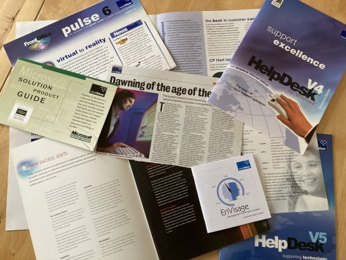

# Marcomms

This section provides scans and photos of some of the marketing materials I produced while working for Royalblue Technologies.

## Ghost-written articles

I ghost wrote some articles for the Managing Director.

[The glue that creates a seamless customer interface](marcomms/glue.md) - an article for the Service Management journal that I ghost wrote.

[Dawning of the age of the sages](marcomms/age-of-sages.md)

## Case studies

I visited a number of reference customers while working for Royalblue Technologies and interviewed them about how our software had improved their support operation. I then wrote a case study about each one, highlighting the improvements and cost savings implementing our software had given.

[AccuRead](marcomms/AccuRead.md) - measured support

[Barclays](marcomms/barclays-case-study.md) - building on ideas

[ICE](marcomms/ice-case-study.md) - highly engineered support

[Lloyd TSB](marcomms/Lloyds-case-study.md) - serving their customers

[MFS WorldCom](marcomms/mfs-case-stud.md) - to be the best, work with the best

[Novartis](marcomms/novartis-case-study.md) - controlling fleas

[Planning Inspectorate](marcomms/planning-case-study.md) - long-term support
